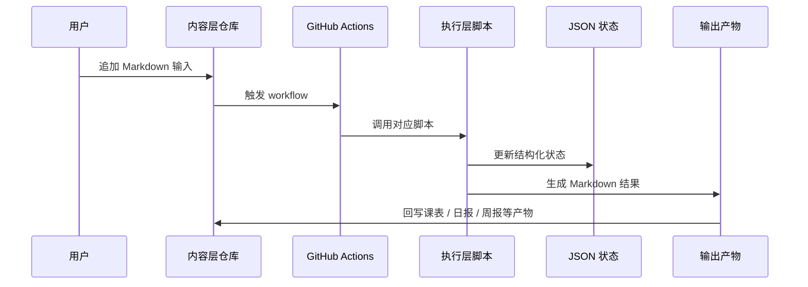

# 事件流说明

## 典型链路

```mermaid
sequenceDiagram
    participant U as 用户
    participant C as 内容层仓库
    participant W as GitHub Actions
    participant S as 执行层脚本
    participant D as JSON 状态
    participant O as 输出产物

    U->>C: 追加 Markdown 输入
    C->>W: 触发 workflow
    W->>S: 调用对应脚本
    S->>D: 更新结构化状态
    S->>O: 生成 Markdown 结果
    O->>C: 回写课表 / 日报 / 周报等产物
```

## 这条链路为什么重要

它说明 ScholarFlow 不是一次性的问答演示，而是一套可以持续运转的“输入 -> 处理 -> 回写”闭环。

## 公开版如何简化

为了安全展示，公开版只保留：

- 事件流结构
- 样例输入与样例输出
- 一条最小可验证链路

而不会公开真实私有仓库写权限、完整 secrets 配置或生产级长期状态。